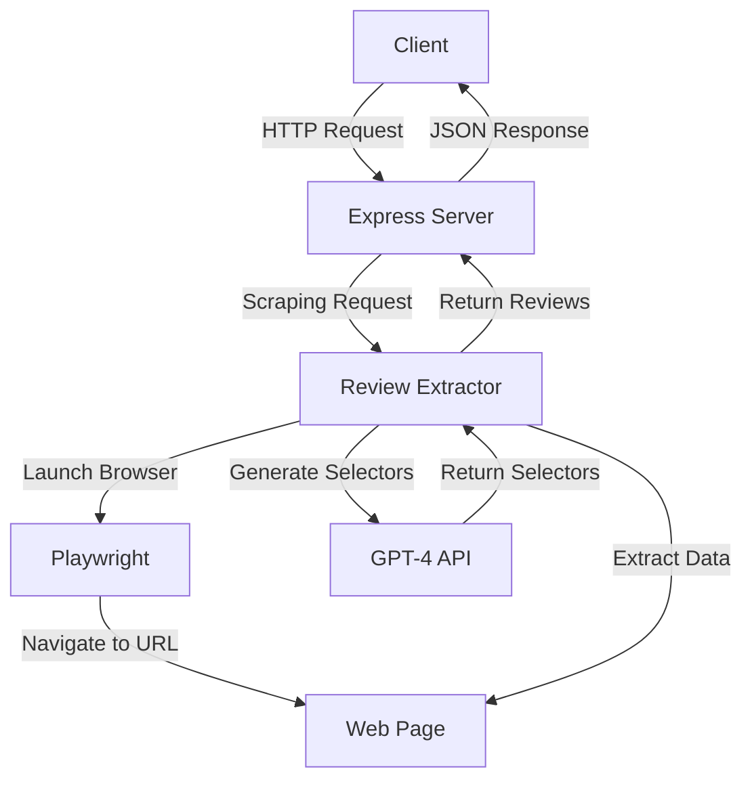

# Review Extractor

## Overview

Review Extractor is a web scraping tool designed to extract product reviews from e-commerce websites' product link. It uses Playwright for browser automation and leverages GPT-4 for dynamic selector generation, making it adaptable to various website structures.

## Solution Approach

1. **Web Scraping**: The core functionality is built around Playwright, which allows for headless browser automation. This enables the tool to navigate web pages, and extract data efficiently.

2. **Dynamic Selector Generation**: The system uses GPT-4 to analyze the page structure and generate appropriate selectors on the fly.

3. **Pagination Handling**: The tool implements a robust pagination system, allowing it to navigate through multiple pages of reviews (up to a maximum of 10 pages).

4. **Error Handling**: Various error handling mechanisms are in place, including popup management and graceful failure when elements are not found.

5. **API Integration**: The scraping functionality is exposed through a RESTful API, making it easy to integrate with other applications.

6. **Frontend**: The root route serves as a frontend for this application

## System Architecture



## Setup Instructions

1. Clone the repository:
   ```
   git clone https://github.com/yourusername/review-extractor.git
   cd review-extractor
   ```

2. Install dependencies:
   ```
   npm install
   ```

3. Set up environment variables:
   Create a `.env` file in the root directory and add the following:
   ```
   OPENAI_API_KEY=your_openai_api_key
   PORT=3000
   ```

4. Run the server:
   ```
   cd api
   node server.js
   ```

## API Usage

### Frontend: GET /


### Endpoint: GET /api/reviews

**Parameters:**
- `page`: The URL of the product page to scrape reviews from


**Example Request:**
```
GET http://localhost:3000/api/reviews?page=https://example.com/product
```

**Example Response:**
```json
{
  "reviews_count": 50,
  "reviews": [
    {
      "title": "Great product!",
      "body": "I love this item. It's exactly what I was looking for.",
      "rating": 5,
      "reviewer": "John D."
    },
    {
      "title": "Good, but could be better",
      "body": "The product works well, but I wish it had more features.",
      "rating": 4,
      "reviewer": "Jane S."
    }
    // ... more reviews
  ]
}
```

## Limitations and Future Improvements

- Optimize the closePopUps time and and "See All Reviews" click time as these get fired on normal pages also. 
- Selector generation could be further optimized for speed
- Implement caching to reduce API calls and improve performance

